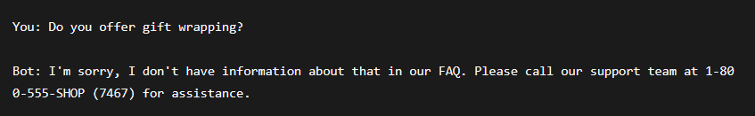

# 🤖 Customer Support Chatbot with Amazon Bedrock

[](https://aws.amazon.com/)
[](https://www.python.org/)
[](https://aws.amazon.com/bedrock/)
[](LICENSE)

An AI-powered customer support chatbot built with **Amazon Bedrock AgentCore** that handles bug reports, FAQ questions, and redirects other requests.

---

## 📋 Table of Contents

- [Overview](#overview)
- [Features](#features)
- [Technologies Used](#technologies-used)
- [Results](#results)
- [Architecture](#architecture)
- [Project Structure](#project-structure)
- [Setup Instructions](#setup-instructions)
- [Testing & Evaluation](#testing--evaluation)
- [Screenshots](#screenshots)
- [Cleanup](#cleanup)
- [License](#license)

---

## 🎯 Overview

This project implements a **customer support chatbot** using Amazon Bedrock's AgentCore managed harness. The chatbot automatically:

1. **Classifies** incoming customer messages
2. **Routes** them to the appropriate handler
3. **Takes action** based on the request type

The chatbot is designed for a fictional online shop and handles three types of requests:

| Request Type | Action |
|--------------|--------|
| 🐛 **Bug Reports** | Collects details → Creates ticket in DynamoDB |
| ❓ **Platform Questions** | Answers from embedded FAQ |
| 📞 **Other Requests** | Redirects to human support |

---

## ✨ Features

| Feature | Description |
|---------|-------------|
| **Single System Prompt** | All routing and behavior controlled by one text file |
| **Multi-Turn Conversations** | Maintains context across multiple messages |
| **Tool Integration** | Lambda function creates tickets via AgentCore Gateway |
| **Database Storage** | Bug reports stored in Amazon DynamoDB |
| **Automated Evaluation** | LLM-as-a-judge testing with perfect score |
| **Perfect Score** | 1.00/1.00 correctness on all test cases |

---

## 🛠️ Technologies Used

| Technology | Purpose |
|------------|---------|
| **Amazon Bedrock** | AI model hosting and orchestration |
| **Amazon Nova Pro** | Large Language Model (LLM) |
| **AWS Lambda** | Serverless compute for bug report tool |
| **Amazon DynamoDB** | Bug ticket storage |
| **AWS CloudFormation** | Infrastructure as Code |
| **Python 3.10+** | Application logic |
| **AgentCore Gateway** | Tool execution and session management |

---

## 🏆 Results

| Metric | Score |
|--------|-------|
| **Evaluation Score** | **1.00/1.00** ✅ |
| **Test Cases Passed** | 3/3 (100%) |
| **Bug Report** | ✅ All 3 fields collected |
| **FAQ Handling** | ✅ Accurate answers |
| **Other Requests** | ✅ Proper redirects |

---

## 🏗️ Architecture

```
┌─────────────────────────────────────────────────────────────────────────────┐
│                           Customer Message                                  │
└─────────────────────────────────────────────────────────────────────────────┘
                                      │
                                      ▼
┌─────────────────────────────────────────────────────────────────────────────┐
│                         AI Classifies Message                               │
│                  (Bug Report / FAQ Question / Other)                        │
└─────────────────────────────────────────────────────────────────────────────┘
                                      │
              ┌───────────────────────┼───────────────────────┐
              │                       │                       │
              ▼                       ▼                       ▼
┌─────────────────────┐ ┌─────────────────────┐ ┌─────────────────────┐
│   🐛 Bug Report     │ │   ❓ FAQ Question   │ │   📞 Other Request   │
│                     │ │                     │ │                     │
│ Collect:            │ │ Answer from:        │ │ Redirect to:        │
│ • Description       │ │ • Online Shop FAQ   │ │ 1-800-555-SHOP      │
│ • Steps to Reproduce│ │                     │ │                     │
│ • Environment       │ │ If not covered:     │ │                     │
│                     │ │ Redirect to phone   │ │                     │
│ Create ticket in    │ │                     │ │                     │
│ DynamoDB            │ │                     │ │                     │
└─────────────────────┘ └─────────────────────┘ └─────────────────────┘
```

---

## 📂 Project Structure

```
customer-support-chatbot-bedrock/
│
├── README.md                          # Documentation
│
├── 📁 src/                            # Python source code
│   ├── chat.py                        # Chat interface
│   ├── create_harness.py              # Creates AI bot
│   ├── eval_harness.py                # Evaluation script
│   ├── create_bug_report.py           # Lambda function
│   └── generate-eval-dataset.py       # Test data generator
│
├── 📁 infrastructure/                 # AWS resources
│   ├── cloudformation-tool.yaml       # Lambda + DynamoDB
│   └── cloudformation-testing.yaml    # Evaluation resources
│
├── 📁 config/                         # Configuration files
│   ├── system_prompt.txt              # AI system prompt
│   ├── online_shop_faq.md             # FAQ document
│   ├── harness-tests.json             # Test cases
│   ├── output_eval_dataset.jsonl      # Evaluation results
│   ├── bug_report_transcript.txt      # Bug conversation
│   ├── evaluation_observations.txt    # Score interpretation
│   └── requirements.txt               # Python dependencies
│
├── 📁 tests/                          # Test templates
│   ├── harness-tests-template.json
│   └── flow-tests-template.json
│
└── 📁 screenshots/                    # Visual evidence
    ├── 01_bug_report.png
    ├── 02_faq_question.png
    ├── 03_other_request.png
    ├── 04_dynamodb.png
    ├── 05_evaluation_results.png
    └── 06_uncovered_question.png
```

---

## 🔧 Setup Instructions

### Prerequisites

- AWS Account with Bedrock access
- Python 3.10+
- AWS CLI configured

### Step 1: Clone the Repository

```bash
git clone https://github.com/YOUR_USERNAME/customer-support-chatbot-bedrock.git
cd customer-support-chatbot-bedrock
```

### Step 2: Install Dependencies

```bash
pip install -r config/requirements.txt
```

### Step 3: Configure AWS Credentials

```bash
aws configure
# Enter your Access Key, Secret Key, region: us-east-1
```

### Step 4: Deploy AWS Resources

```bash
aws cloudformation deploy \
  --template-file infrastructure/cloudformation-tool.yaml \
  --stack-name bug-report-tool-stack \
  --capabilities CAPABILITY_NAMED_IAM \
  --region us-east-1
```

### Step 5: Create the Chatbot Harness

```bash
python src/create_harness.py
```

### Step 6: Chat with the Bot

```bash
python src/chat.py
```

---

## 🧪 Testing & Evaluation

### Run Automated Tests

```bash
python src/eval_harness.py --tests-json config/harness-tests.json
```

### Upload Results to S3

```bash
aws s3 cp config/output_eval_dataset.jsonl \
  s3://YOUR_BUCKET_NAME/output_eval_dataset.jsonl \
  --region us-east-1
```

### Create Bedrock Evaluation Job

```bash
aws bedrock create-evaluation-job \
  --job-name support-chatbot-eval \
  --role-arn YOUR_ROLE_ARN \
  --evaluation-config '{
    "automated": {
      "datasetMetricConfigs": [{
        "taskType": "General",
        "dataset": {
          "name": "support-chatbot-eval-dataset",
          "datasetLocation": {
            "s3Uri": "s3://YOUR_BUCKET_NAME/output_eval_dataset.jsonl"
          }
        },
        "metricNames": ["Builtin.Correctness"]
      }],
      "evaluatorModelConfig": {
        "bedrockEvaluatorModels": [{
          "modelIdentifier": "amazon.nova-pro-v1:0"
        }]
      }
    }
  }' \
  --inference-config '{
    "models": [{
      "precomputedInferenceSource": {
        "inferenceSourceIdentifier": "support-chatbot"
      }
    }]
  }' \
  --output-data-config '{"s3Uri": "s3://YOUR_BUCKET_NAME/results/"}' \
  --region us-east-1
```

---

## 📸 Screenshots

### 1. Bug Report Handling

*Chatbot asks clarifying questions about the bug and collects required information*

### 2. FAQ Question Handling

*Chatbot provides accurate answer from the embedded FAQ document*

### 3. Other Request Handling

*Chatbot politely redirects out-of-scope requests to human support*

### 4. Uncovered FAQ Question

*Chatbot redirects to phone support when FAQ doesn't cover the question*

### 5. Database Record

*Bug ticket successfully saved in DynamoDB with all collected information*

### 6. Evaluation Results

*Perfect score of 1.00/1.00 on all test cases*

---

## 🧹 Cleanup

Delete all resources to avoid ongoing charges:

```bash
# Delete the testing stack
aws cloudformation delete-stack \
  --stack-name bug-report-testing-stack \
  --region us-east-1

# Delete the tool stack
aws cloudformation delete-stack \
  --stack-name bug-report-tool-stack \
  --region us-east-1

# Empty and delete S3 bucket (if needed)
aws s3 rm s3://YOUR_BUCKET_NAME --recursive --region us-east-1
```

---

## 📊 Evaluation Observations

| Test Case | Score | Observation |
|-----------|-------|-------------|
| Bug Report | 1.00 | Correctly collected description, steps, environment |
| FAQ Question | 1.00 | Accurate answer from FAQ |
| Other Request | 1.00 | Polite redirect to phone support |

**Summary**: The chatbot achieved a perfect score of 1.00/1.00, demonstrating correct routing, information gathering, and response generation across all three test scenarios.

---

## 📄 License

This project is licensed under the MIT License - see the [LICENSE](LICENSE) file for details.

---

## 🙏 Acknowledgments

- Built with ❤️ using **Amazon Bedrock**
- Powered by **Amazon Nova Pro** LLM

---

**Built with ❤️ using Amazon Bedrock**
