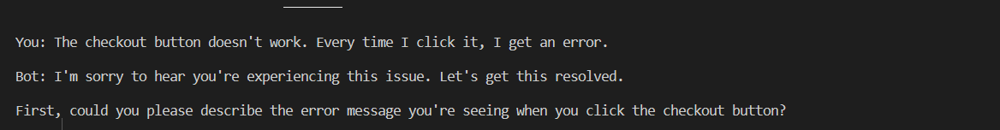
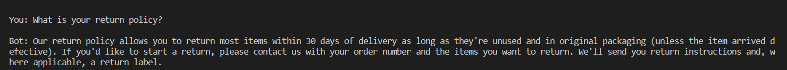
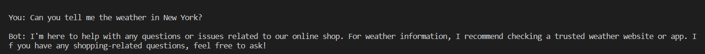
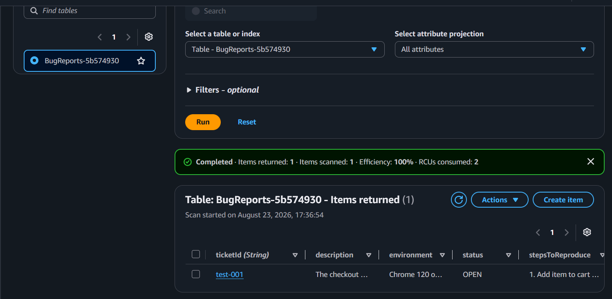
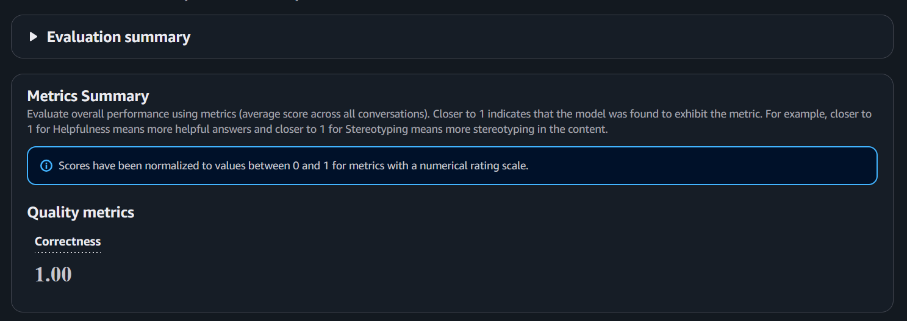

# Customer Support Chatbot with Amazon Bedrock

AI-powered customer support chatbot using Amazon Bedrock AgentCore.

## Features
- 🐛 Bug Reports - Collect details and create tickets
- ❓ FAQ Questions - Answer from embedded FAQ
- 📞 Other Requests - Redirect to human support

## Results
- ✅ Perfect Score: 1.00/1.00
- ✅ All 3 Test Cases Passed

## Technologies
- Amazon Bedrock (Nova Pro)
- AWS Lambda
- Amazon DynamoDB
- Python

## Screenshots

